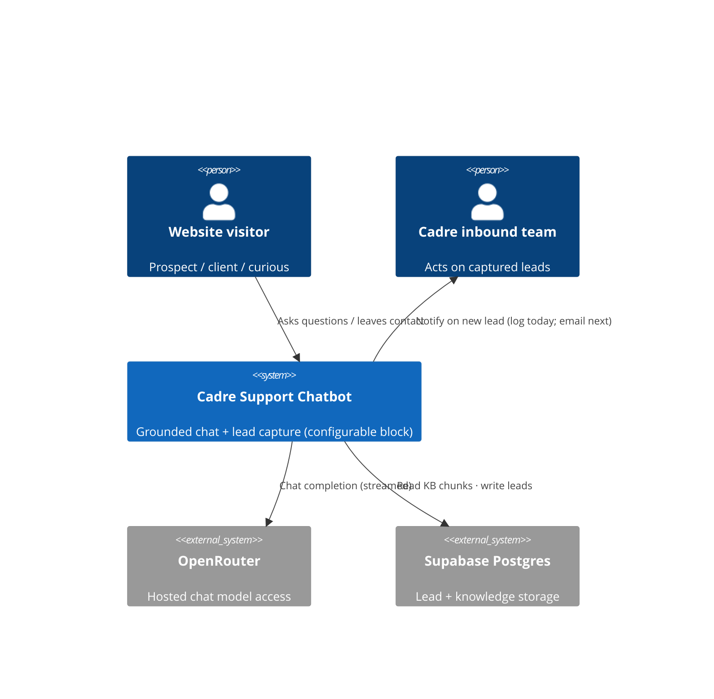

# Cadre AI Support Chatbot — Concept Note

> **Status:** Draft (rev 2) · **Date:** 2026-09-07 · **Owner:** Andrés Martiliano
>
> **Reviewers:** Cadre AI review panel (day-5 live review)
>
> **Spec:** [./spec.md](./spec.md) *(in progress)* · **Implementation plan:** [../plan.md](../plan.md) *(pending)*

## 1. TL;DR

We are building a **customer-support chatbot for Cadre AI's inbound team** — implemented as a
**configurable, reusable "conversational system" block**, not a one-off. It answers the common
prospect/client questions (what Cadre does, industry fit, **the AI Maturity Index and how to get
scored**, portal access, its **LLM-selection and data-security posture**, how to book a call) from
a curated, retrieval-grounded knowledge base, and **escalates by capturing a lead** when it can't
or shouldn't answer. **The single most important decision:** the bot **answers posture but never
invents guarantees or pricing** — grounded answers where Cadre has published a fact, a clean
"let me connect you" where it hasn't. The architecture is a **shell parameterized by a typed
`ClientProfile`** (corpus, persona, brand, model, escalation target, CTA), so the same block
re-skins for the next client by swapping config, not code.

This is a take-home challenge (recommended 4–6h build; ~4h budgeted). Scope is deliberately cut to
a small number of features that work over a large number that don't.

## 2. Problem statement

Cadre's inbound channel receives a growing mix of prospective clients, existing clients, and the
merely curious. Every repetitive inquiry a strategist answers by hand is time not spent on
high-value conversations.

- **Pain 1 — Repetitive triage.** "What do you do / do you work with my industry / how do I book a
  call / what's the AI Maturity Index?" are asked constantly and have stable answers, yet consume
  human time.
- **Pain 2 — Slow first response.** A prospect who waits for a human to answer a basic question may
  leave. A 24/7 first-touch that also *captures the lead* keeps them reachable.
- **Pain 3 — Inconsistent / risky answers.** Free-form human answers to sensitive questions
  (pricing, data security) vary. A grounded bot with an explicit "posture yes, guarantees no"
  policy is more consistent and safer than ad-hoc replies.

## 3. Goals

- Deflect the most common inbound questions with **accurate, Cadre-grounded** answers — including
  the Cadre-specific ones (AI Maturity Index, portal, security posture).
- **Answer posture, never fabricate specifics** — pricing, certifications, retention terms, and
  portal logins are routed to a human, with the lead captured.
- Provide a **reliable escalation path**: capture name/email/context as a lead the inbound team can
  act on, and surface the "Talk to an AI Strategist" call-to-action.
- Ship it **as a reusable block**: a configurable shell with clean component seams, so the build
  pays off across future client deployments — and a **deployed, public MVP** to prove it.

## 4. Non-goals

- **We are not building authentication or a real client portal.** The bot *explains what the
  portal is and how access is arranged*; it does not implement login, dashboards, or account state.
- **We are not building a pricing engine or quoting anything.** Pricing is policy-declined.
- **We are not crawling or indexing the full cadre.ai site.** Knowledge is a small curated corpus.
- **We are not building an admin console, multi-tenant support, or conversation analytics.**
- **We are not fine-tuning or self-hosting a model.** We call a hosted model via OpenRouter.

## 5. Vision / desired end state

A visitor opens the chat and asks "Do you work with private-equity-backed manufacturers?" The bot
answers from Cadre's real positioning — yes, naming the relevant industries and services — and
offers to book a strategy call. Another asks "What's the AI Maturity Index and how do I get
scored?" The bot explains the eight-pillar framework and treats "how do I get scored" as a handoff,
capturing the lead. A third asks "What's your pricing?" The bot explains pricing is scoped per
engagement, declines to quote, and captures their email in the same breath. The inbound team wakes
up to a short list of qualified leads instead of a full inbox of FAQs — and because the bot is a
**configurable block**, the next client's bot is a new `ClientProfile`, not a new project.

### 5.1 System context diagram

### 5.2 Security posture (`MD-31`)

- **Feature exposure** — External, untrusted HTTP input from anonymous public website visitors
  (free-text chat + a lead form). Prompt-injection and abuse of the free-text field are in scope.
- **Data sensitivity** — Low-volume PII only: lead **name + email + a short message excerpt**. No
  payment data, no credentials, no regulated PHI. The OpenRouter API key is a sensitive secret
  (server-side only).
- **Deployment surface** — Public serverless endpoints on Vercel (Next.js route handlers);
  Postgres reached server-side via Supabase with the service role key never exposed to the client.

> These lines select the CWE Top 25 categories the Spec §4.5 must address — primarily injection
> (XSS in chat rendering, SQL injection via the data layer), secrets exposure, and
> resource-exhaustion / cost-abuse of the metered LLM budget.

## 6. Context & background

- **Existing system** — None. Greenfield repository initialized for this challenge. Only inputs are
  the brief, the assessment PDF (`Cadre_AI_Chatbot_Take_Home_Candidate_v1.1.pdf`), the role's job
  description (Staff Product Architect), and public cadre.ai content.
- **Related work** — Cadre is an **Official OpenAI Service Partner** with frontier access via
  Anthropic and OpenAI; publicly lists partners OpenAI, Anthropic, Google, Microsoft, AWS,
  Salesforce, Snowflake (+ OpenRouter for model access). The role sells solutions as reusable
  **"blocks,"** one of which is *conversational systems* — this bot is exactly that block.
- **Organisational context (constraints)** — 4-hour build budget; graded on 5 weighted dimensions
  (Claude Code proficiency 30%, System Design 25%, Dev Speed & Scope 20%, Code Quality 15%,
  Communication 10%); hard deliverables: a live public URL, `CLAUDE.md` + `plan.md` at root, a zip
  **including `.git`**. OpenRouter key has a **$5 budget, 7-day expiry**. Due Tue 2026-09-08;
  review Wed 2026-09-09.

### 6.5 Sources & Origins (`MD-25`)

**Codebase evidence** — `Codebase evidence: none — greenfield feature, no existing codebase.`

**Industry-standard evidence**

- *Regulatory:* GDPR/CCPA data-minimization — the lead form collects only name+email+excerpt; not
  over-collecting and having a lawful basis is the only obligation at this scale. No HIPAA/PCI.
- *Architectural:* 12-factor config (secrets via env, never committed); OWASP LLM Top 10 (LLM01
  prompt-injection, LLM06 sensitive-info disclosure) informs the grounding + "posture yes,
  guarantees no" policy; ISO 25010 (reliability, security, cost-efficiency) informs the NFRs.
- *Style / project convention:* `CLAUDE.md` (to be authored) is the agent-onboarding contract the
  assessment grades directly.

**Prior-art evidence**

- **Intercom Fin / Ada** — ground answers in a curated corpus and explicitly hand off outside it;
  the "grounded-or-handoff" contract is our F1+F3.
- **Drift** — treats lead capture/routing as the primary value; reinforces escalation-to-lead as a
  first-class feature, not an afterthought.
- **RAG** (Lewis et al., 2020, arXiv:2005.11401) — retrieve-then-generate reduces hallucination;
  we use a deliberately minimal variant (small corpus, local embeddings, brute-force cosine).

### 6.6 Key assumptions (gaps the brief left to us — decided, not deferred)

The brief hands three facts to "Cadre," who we cannot ask before submission. We resolve them as
defended assumptions rather than open questions; each is a KB/config change if reality differs.

- **A-1 Booking.** *Verified:* cadre.ai has **no scheduling integration** — only a contact form,
  `hello@gocadre.ai`, and a phone number. The bot surfaces the contact path **and** captures a lead
  in the same turn so the visitor becomes reachable without leaving chat. *If Cadre has an internal
  scheduler, wiring it is a KB/config change, not a code change.*
- **A-2 Data-security posture.** Cadre publishes no certifications or retention terms. The bot may
  state **posture** (model-agnostic across OpenAI/Anthropic/Google/Microsoft/AWS; model selected
  per use case; server-side key handling; what *this* bot retains) and must **decline guarantees**
  (certs, retention periods, contractual data terms). *"Posture yes, guarantees no."*
- **A-3 Portal.** Cadre publicly describes a **"centralized portal to track tools, agents,
  training, and results."** The bot answers *what it is* in full and routes only on *how to get in*
  ("access is provisioned by your Cadre team as part of an engagement"). We do not build the portal
  (§4).
- **A-4 Persistence (data minimization).** We assume **no consent basis** to log anonymous
  conversations from a public site, so we persist only **name/email/excerpt** — no transcripts.
  *This does not block the key metric:* **deflection rate is measurable from session-level outcome
  logs alone** (answered vs. escalated, no PII — NFR-006), so no transcripts and no consent notice
  are needed. Transcripts would only add *why* a session escalated, not *whether* it did.

## 7. Research & industry context

*Folded into §6.5 (Sources & Origins) to avoid duplication — peer products (Intercom Fin/Ada,
Drift), the RAG citation (arXiv:2005.11401), and the OWASP LLM Top 10 (LLM01/LLM06) are cited there.*

## 8. Proposed direction

### 8.1 Approach — a configurable shell of reusable blocks

A single Next.js (App Router) app on Vercel, structured as a **shell parameterized by a typed
`ClientProfile`** and assembled from **named component seams**.

**What "parameterized" means here — the bar a component clears to count as reusable:**

- **Forked** — copied and edited per client. Not reusable.
- **Configurable** — behaviour changes via `ClientProfile`, no code edit.
- **Productized** — Configurable *and* versioned, documented, with a second live deployment.

| Component | Configuration surface | Level | Build hrs | Client #2 | Attaches to (other Cadre blocks) |
|---|---|---|---|---|---|
| `KnowledgeRetriever` | corpus, k, threshold | Configurable | ~1.5 | reused as-is | document analysis, scoring engines |
| `LlmProvider` | model id, params, base URL | Configurable | ~1.0 | reused as-is | every LLM-backed block |
| `ChatOrchestrator` | persona, policy, triggers | Configurable | ~1.0 | reused as-is | conversational systems |
| `LeadStore` | table/schema (Supabase) | Configurable | ~0.75 | reused as-is | conversational systems |
| `Notifier` | impl (log today, email next) | Configurable (1 impl) | ~0.5 | reused as-is | conversational systems |
| `ClientProfile` | corpus, persona, brand, model, escalation, CTA | Configurable | ~1.0 | authored fresh (~1–2h) | the shell itself |

**Reasoning in hours (the attachment-rate lens).** The six seams took ~6 engineering hours. Client
#2 reuses five unchanged — only the `ClientProfile` + corpus are authored fresh (~1–2h), so the
*marginal* cost of a second conversational-system engagement is ~1–2h vs. ~6h for the first:
**~70% of the build amortizes**. Two seams — `KnowledgeRetriever` and `LlmProvider` — aren't
conversational-specific; they attach to Cadre's **document-analysis and scoring-engine** blocks too,
so their reuse compounds across the library, not just within conversational systems. That is where
productization pays back first: productize the high-attachment seams (retrieval, LLM) before the
conversational-only ones (`LeadStore`, `ChatOrchestrator`). The second profile
(`CLIENT_PROFILE=northwind`) is the live proof the swap costs code-zero — moving the shell from
Configurable toward Productized (a second deployment exists; versioning + docs are the remaining bar).

The browser renders a streaming chat UI. A server route scores the user turn against the **curated
corpus** (lexical retrieval — see L-12), composes a grounded prompt (answer only from context;
**posture yes, guarantees no**; stay on-topic), and streams a completion via **OpenRouter**.
**Escalation triggers** — explicit human request, pricing/quote, "how do I get scored" (AI Maturity
Index), "how do I access the portal," security *guarantees*, or a query the corpus can't support —
surface a **lead form**; submitting writes a Lead to **Supabase** behind the pluggable `Notifier`.
A persistent, profile-driven CTA (e.g. "Talk to an AI Strategist") opens the lead form.

### 8.2 Information / data model sketch

- **KbChunk** — `id`, `sourceUrl`, `title`, `text`. The curated corpus (services, industries,
  **AI Maturity Index: eight-pillar framework, grade per area with insights**, portal, security
  posture, booking). Lexically indexed at load (L-12); no embeddings.
- **Lead** — `id`, `name`, `email`, `excerpt` (the escalating turn), `reason`, `status` (new),
  `createdAt`. The unit of escalation and the inbound team's work item. **Deliberately excludes**
  full transcripts (A-4).

## 9. Alternatives considered

### 9.1 Alternative A — Curated in-context knowledge base (no retrieval)

- **Description:** Bake the whole corpus into the system prompt; no embedding/retrieval.
- **Pros:** Simplest; zero retrieval failure modes; fastest to build.
- **Cons:** Doesn't scale; weaker architecture story; every token billed each turn.
- **Decision:** **Rejected** — reviewer weights System Design 25%; a real (if minimal) RAG
  demonstrates the pattern; corpus is small enough that retrieval cost is trivial.

### 9.2 Alternative B — Full RAG over a crawl of cadre.ai (vector DB)

- **Description:** Crawl the site, chunk, embed via an API, store in pgvector, tune retrieval.
- **Pros:** Most impressive; closest to production.
- **Cons:** Crawl+chunk+embed+tune is the classic way to burn a 4h budget; adds an embedding-API
  dependency and a vector store to operate.
- **Decision:** **Deferred** — pgvector + a larger corpus return if time allows (§14).

### 9.3 Alternative C — Selected: simple RAG, curated corpus, local embeddings

- **Description:** Small curated corpus + local MiniLM embeddings + brute-force cosine top-k.
- **Pros:** Real retrieval with **no external embedding dependency and no vector-DB ops**;
  deterministic; instant at this scale; clean "here's when I'd switch to pgvector" story.
- **Cons:** Not production-scale; brute-force is O(n) per query (fine for ~150 chunks).
- **Decision:** **Selected** — best quality-per-hour for the budget.

### 9.3b Comparison summary

| Dimension | A: In-context | B: Full RAG crawl | C: Simple RAG (selected) |
|---|---|---|---|
| Build time | Lowest | Highest | Low–Medium |
| Failure modes | Fewest | Most | Few |
| Architecture signal | Weak | Strong | Strong-enough |
| Per-turn cost | Highest | Low | Low |
| Scales past MVP | No | Yes | Swap to pgvector (deferred) |

## 10. Key decisions

| ID | Decision | Rationale | Reversibility |
|---|---|---|---|
| D-01 | Next.js (App Router) full-stack on **Vercel + Supabase** | One repo, one deploy (lowest deployment risk — graded); Postgres serves leads + optional pgvector; fluent stack | Hard (post-deploy) |
| D-02 | **Simple RAG** over a small **curated** Cadre corpus | Real grounding without crawl/vector-DB overhead; fits budget | Easy |
| D-03 | Retrieval without a vector DB at MVP. *Amended at build (L-12): shipped **lexical BM25** instead of local embeddings* | Instant, zero cold-start on serverless, deploys anywhere; corpus is tiny; interface keeps embeddings/pgvector a drop-in | Easy |
| D-04 | Chat model = **Google Gemini 2.5 Flash via OpenRouter**, selected by env var | Cheap + fast + strong instruction-following protects the $5 budget and demo latency; swappable | Easy |
| D-05 | Escalation writes a **Lead** to Supabase behind a pluggable **`Notifier`**; impl **today = Postgres + log**, **next = email to the inbound team** | Decouples capture from notification; email fits a San Diego B2B team without an external channel dependency | Easy |
| D-06 | **No auth / no portal build**; the bot *explains* the portal and how access is arranged | Out of budget; not the graded core (§4) | Easy |
| D-07 | **Posture yes, guarantees no.** Bot **answers** LLM-selection & data-security *posture* (model-agnostic across major providers; selection per use case; server-side keys; what this bot retains) and **declines** *guarantees* (certs, retention periods, contractual terms) and **pricing** | The brief asks the bot to *handle* "LLM selection and data security" — so it must answer posture; safety applies only to unverifiable guarantees | Easy |
| D-08 | **Grounding-only answering**: system prompt restricts answers to retrieved context + explicit fallback | Targets the 25% system-prompt dimension and hallucination risk | Easy |
| D-09 | **Structured lead capture** (name/email/excerpt) over **redirect-only** | Brief allows "escalate *or redirect*"; a bare redirect drops the conversation context the strategist needs — the extra table+form buys a qualified, context-rich handoff | Easy |
| D-10 | **Configurable shell**: a typed `ClientProfile` parameterizes corpus/persona/brand/model/escalation/CTA; named seams (`KnowledgeRetriever`, `LlmProvider`, `LeadStore`, `Notifier`, `ChatOrchestrator`) | The bot is one of Cadre's reusable "blocks"; build-once-configure-many is the role's core competency and the System Design story | Medium |
| D-11 | **Data minimization**: persist only name/email/excerpt; **no anonymous transcript logging** | No consent basis on a public site; keeps PII surface minimal — accepts the deflection-rate measurement gap (§12) | Easy |

## 11. Risks

| Risk | Severity | Likelihood | Mitigation idea |
|---|---|---|---|
| Bot fabricates a Cadre specific (pricing, cert, retention, portal login) | High | Med | Grounding-only prompt (D-08) + "posture yes, guarantees no" (D-07); acceptance tests per case |
| $5 OpenRouter budget exhausted before/at review | Med | Med | Cheap model (D-04); cap max tokens/turn; light rate-limit; don't loop during testing |
| Deployment fails under time pressure | Med | Med | Deploy a skeleton to Vercel **first** (D-01), iterate live |
| Prompt injection / abuse of free-text field | Med | Med | System-prompt guardrails; bot has no privileged tools beyond lead insert; escape output in UI |
| Lexical retrieval misses a paraphrase (no semantics) | Low | Med | Small curated corpus; add embeddings/pgvector if misses appear (L-12) |

## 12. Success signals

- The bot answers all six seed scenarios plausibly in a live demo **without fabricating** —
  including the AI Maturity Index and the security *posture*.
- Every "can't answer / wants human / how-do-I-get-scored" path reliably **produces a Lead row**.
- Total OpenRouter spend across build + testing + demo stays **well under $5**.
- The deployed URL is reachable and responsive during the review.
- **Deflection rate** (share of sessions resolved without escalation) — **measured from
  session-level outcome logs** (answered vs. escalated, no PII; NFR-006). Shipped, not deferred;
  transcript logging (behind consent) would only add the *why*.

## 13. Dependencies & stakeholders

### 13.1 Dependencies

- **Services / vendors:** OpenRouter (chat), Supabase (Postgres), Vercel (hosting).
- **Upstream specs / RFCs:** none.
- **Downstream consumers:** Cadre inbound team (consumes captured leads).

### 13.2 Stakeholders

Solo build for the take-home: author (candidate), reviewer (Cadre engineering, day-5), end users
(Cadre website visitors).

## 14. Out of scope / deferred

- **pgvector + larger/crawled corpus** — *deferred until* the MVP is deployed and time remains, or
  the corpus outgrows brute-force cosine.
- **Email `Notifier` implementation** — *deferred until* core lead capture works; the seam exists
  now, the second impl is a small addition.
- **Transcript-based analysis (the *why* behind escalations)** — *deferred until* someone needs it;
  requires transcript logging behind a consent notice. Deflection *rate* itself already ships via
  outcome logs (§12, NFR-006).

## 15. Open questions

| ID | Question | Owner | Target stage | Notes |
|---|---|---|---|---|
| OPEN-Q-01 | Confirm Gemini 2.5 Flash is live on OpenRouter at the expected price; else pick nearest cheap/fast model | Andrés | Plan | D-04 is swappable via env; build-time verification, self-owned |
| OPEN-Q-02 | Add deflection-rate measurement (needs a consent notice)? | Andrés | Post-launch | Forward-looking, self-owned; not a blocker |

## 16. Handoff to the Spec

- **Settled (do not relitigate):** D-01 … D-11, and assumptions A-1 … A-4.
- **Decide in Spec:** nothing Cadre-owned remains open; the Spec turns D-07/D-08/D-09 into
  behavioural requirements and A-1…A-4 into acceptance criteria. (OPEN-Q-01 → Plan; OPEN-Q-02 →
  Post-launch.)
- **Must remain non-goals (verbatim):**
  - "We are not building authentication or a real client portal."
  - "We are not building a pricing engine or quoting anything."
  - "We are not crawling or indexing the full cadre.ai site."
  - "We are not building an admin console, multi-tenant support, or conversation analytics."
  - "We are not fine-tuning or self-hosting a model."

## 17. Appendix

- Assessment (converted to MD): `../reference/take-home-assessment.md`.
- Role framing (converted to MD, PII-free): `../reference/staff-product-architect-jd.md`.
- Methodology driver: `../reference/take-home-prompt.md`.
- Process decision log: `../decisions.md` (L-01 … L-10).
- Cadre facts grounded from cadre.ai (home, /strategy, /contact) + web search — see decisions.md
  L-07 for the consolidated fact list.

## 18. Change log

| Date | Author | Change |
|---|---|---|
| 2026-09-07 | Andrés Martiliano | Initial draft. Self-critique: skipped (first-run baseline). |
| 2026-09-07 | Andrés Martiliano | Rev 2 from review: D-07 split (posture yes/guarantees no); added D-09 (lead vs redirect), D-10 (configurable shell), D-11 (data minimization); booking/security/portal → assumptions A-1…A-4; AI Maturity Index promoted to KB + escalation trigger; WhatsApp cut (kept `Notifier` seam, next impl = email); open questions reduced to 2 self-owned items. Self-critique: skipped (offered to reviewer). |
| 2026-09-07 | Andrés Martiliano | Rev 3 from build + review round 2: §8.1 gains the reuse-economics table (build/reuse hours, cross-block attachment) + the Forked/Configurable/Productized ladder; deflection reframed as *measured* from outcome logs (A-4, §12, §14; NFR-006), not deferred; D-03 amended to lexical retrieval (L-12); §7 folded into §6.5; §13.2 trimmed; §11 embedding-risk row replaced. Ships a second live profile (Northwind) making AC-16 demonstrable. |

---

*Next document: [Spec](./spec.md). The Spec defines what the system shall do, how it shall behave,
and which solutions are admissible.*
