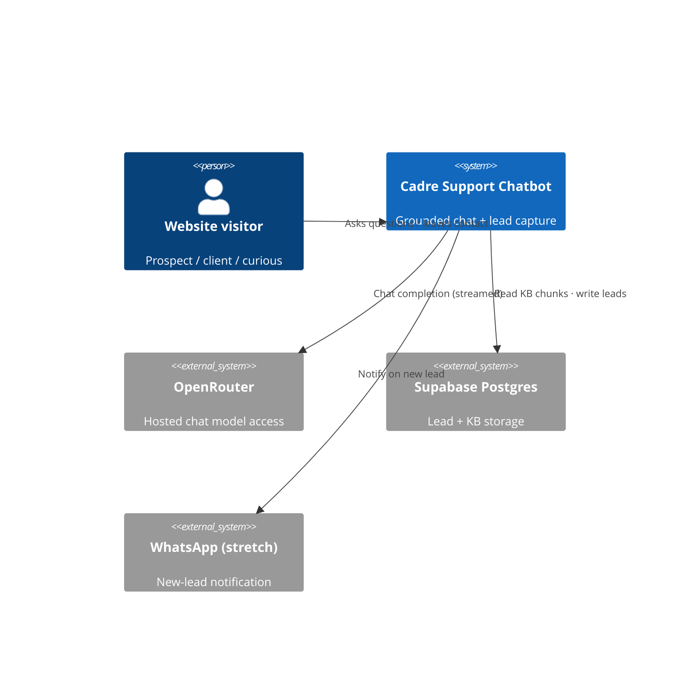

# Cadre AI Support Chatbot — Concept Note

> **Status:** Draft · **Date:** 2026-09-07 · **Owner:** Andrés Martiliano
>
> **Reviewers:** Cadre AI review panel (day-5 live review)
>
> **Spec:** [./spec.md](./spec.md) *(in progress)* · **Implementation plan:** [../plan.md](../plan.md) *(pending)*

## 1. TL;DR

We are building a **customer-support chatbot for Cadre AI's inbound team** that answers the most
common prospect/client questions (what Cadre does, industry fit, the AI Maturity Index, portal
access, LLM/security posture, how to book a call) and **escalates cleanly to a human by capturing
a lead** when it can't or shouldn't answer. It is for Cadre's website visitors; it exists so the
inbound team stops spending time on repetitive questions. **The single most important decision:**
the bot answers **only from a curated, retrieval-grounded Cadre knowledge base and declines
(routing to a strategist) on anything it can't ground — especially pricing** — because a
consultancy's support bot inventing facts is worse than one that says "let me connect you."

This is a take-home challenge (recommended 4–6h build; ~4h budgeted). Scope is deliberately cut to
a small number of features that work over a large number that don't.

## 2. Problem statement

Cadre's inbound channel receives a growing mix of prospective clients, existing clients, and the
merely curious. Every repetitive inquiry a strategist answers by hand is time not spent on
high-value conversations.

- **Pain 1 — Repetitive triage.** "What do you do / do you work with my industry / how do I book a
  call?" are asked constantly and have stable answers, yet consume human time.
- **Pain 2 — Slow first response.** A prospect who has to wait for a human to answer a basic
  question is a prospect who may leave. A 24/7 first-touch that can also *capture the lead* keeps
  them engaged.
- **Pain 3 — Inconsistent / risky answers.** Free-form human answers to sensitive questions
  (pricing, data security) vary. A grounded bot with an explicit "decline and route" policy is
  more consistent and safer than ad-hoc replies.

## 3. Goals

- Deflect the most common inbound questions with **accurate, Cadre-grounded** answers.
- **Never fabricate** — unknown/sensitive questions (pricing, security specifics, portal login)
  are declined and routed to a human, with the lead captured.
- Provide a **reliable escalation path**: capture name/email/context as a lead the inbound team
  can act on, and surface the "Talk to an AI Strategist" call-to-action.
- Ship a **deployed, publicly reachable MVP** with a clean architecture story and an honest
  account of what was cut.

## 4. Non-goals

- **We are not building authentication or a real client portal.** The bot *explains* how portal
  access works; it does not implement login, dashboards, or account state.
- **We are not building a pricing engine or quoting anything.** Pricing is policy-declined.
- **We are not crawling or indexing the full cadre.ai site.** Knowledge is a small curated corpus.
- **We are not building an admin console, multi-tenant support, or conversation analytics.**
- **We are not fine-tuning or self-hosting a model.** We call a hosted model via OpenRouter.

## 5. Vision / desired end state

A visitor lands on Cadre's site, opens the chat, and asks "Do you work with private-equity-backed
manufacturers?" The bot answers from Cadre's real positioning — yes, naming the relevant
industries and services — and offers to book a strategy call. Another asks "What's your pricing?"
The bot explains that pricing is scoped per engagement, declines to quote, and offers to connect
them with a strategist — capturing their email as a lead in the same breath. A third asks
something off-topic or beyond the corpus; the bot recognizes the boundary, doesn't bluff, and
escalates. The inbound team wakes up to a short list of qualified leads instead of a full inbox of
FAQs.

### 5.1 System context diagram

### 5.2 Security posture (`MD-31`)

- **Feature exposure** — External, untrusted HTTP input from anonymous public website visitors
  (free-text chat + a lead form). Prompt-injection and abuse of the free-text field are in scope.
- **Data sensitivity** — Low-volume PII only: lead **name + email + message**. No payment data, no
  credentials, no regulated PHI. The OpenRouter API key is a sensitive secret (server-side only).
- **Deployment surface** — Public serverless endpoints on Vercel (Next.js route handlers);
  Postgres reached server-side via Supabase with the service role key never exposed to the client.

> These lines select the CWE Top 25 categories the Spec §4.5 must address — primarily injection
> (XSS in chat rendering, SQL/NoSQL injection via the data layer), secrets exposure, and
> resource-exhaustion / cost-abuse of the metered LLM budget.

## 6. Context & background

- **Existing system** — None. Greenfield repository initialized for this challenge. Only inputs
  are the brief, the assessment PDF (`Cadre_AI_Chatbot_Take_Home_Candidate_v1.1.pdf`), and public
  cadre.ai content.
- **Related work** — Cadre is an **Official OpenAI Service Partner**; publicly lists partners
  OpenAI, Anthropic, Google, Microsoft, AWS, Salesforce, Snowflake (+ OpenRouter for model access).
- **Organisational context (constraints)** — 4-hour build budget; graded on 5 weighted dimensions
  (Claude Code proficiency 30%, System Design 25%, Dev Speed & Scope 20%, Code Quality 15%,
  Communication 10%); hard deliverables: a live public URL, `CLAUDE.md` + `plan.md` at root, a zip
  **including `.git`**. OpenRouter key has a **$5 budget, 7-day expiry**. Due Tue 2026-09-08;
  review Wed 2026-09-09.

### 6.5 Sources & Origins (`MD-25`)

**Codebase evidence** — `Codebase evidence: none — greenfield feature, no existing codebase.`

**Industry-standard evidence**

- *Regulatory:* GDPR/CCPA lite — lead form collects name+email; a consent line + not over-
  collecting is the only obligation at this scale. No HIPAA/PCI (no PHI/payment data).
- *Architectural:* 12-factor config (secrets via env, not committed); OWASP LLM Top 10 (prompt-
  injection, sensitive-info disclosure) informs the grounding + decline policy; ISO 25010 quality
  attributes (reliability, security, cost-efficiency) inform the NFRs the Spec will quantify.
- *Style / project convention:* `CLAUDE.md` (to be authored) is the agent-onboarding contract the
  assessment grades directly.

**Prior-art evidence**

- **Intercom / Drift / Ada** support bots — establish the pattern: grounded FAQ deflection + human
  handoff/lead capture. We mirror the "answer-or-escalate" split, minus the CRM integration depth.
- **Retrieval-Augmented Generation** (Lewis et al., 2020, arXiv:2005.11401) — the grounding
  approach; we use a deliberately minimal variant (small corpus, local embeddings, brute-force
  cosine) appropriate to the corpus size.

## 7. Research & industry context

### 7.1 How established products handle this

- **Intercom Fin / Ada** — ground answers in a curated help-center corpus and *explicitly* refuse
  outside it, handing off to a human. This "grounded-or-handoff" contract is exactly our F1+F3.
- **Drift** — leans on lead capture and routing as the primary value, with the bot as qualifier.
  Reinforces that **escalation-to-lead is a first-class feature, not an afterthought**.

### 7.2 Relevant prior art / papers / standards

- RAG (arXiv:2005.11401) — retrieve-then-generate reduces hallucination vs. parametric-only recall.
- OWASP Top 10 for LLM Applications — LLM01 Prompt Injection, LLM06 Sensitive Information
  Disclosure: both are directly addressed by the grounding + decline-and-route policy.

### 7.3 Proofs of concept

| PoC | Status | Link | What it proved | What it disproved |
|---|---|---|---|---|
| OpenRouter embeddings viability | Not run | — | — | Deferred: assumed unreliable, so embeddings run locally (D-03) instead of risking the hot path |
| Local MiniLM + cosine over ~50–150 chunks | Planned in build | — | Expected: instant retrieval, no vector DB needed at this scale | — |

## 8. Proposed direction

### 8.1 Approach

A single Next.js (App Router) app on Vercel. The browser renders a streaming chat UI. A server
route handler receives the user turn, **embeds it locally** (MiniLM via transformers.js),
retrieves the top-k chunks from a **curated Cadre corpus** by brute-force cosine similarity,
composes a grounded prompt with a strict system prompt (answer only from context; decline+route on
unknowns/pricing; stay on-topic), and streams a completion from a hosted model via **OpenRouter**.
When the model (or a lightweight trigger) determines it cannot help or the user wants a human, the
UI offers a **lead form**; submitting writes a lead row to **Supabase Postgres** behind a pluggable
`notify(lead)` interface (logging by default; WhatsApp as a stretch implementation). A persistent
"Talk to an AI Strategist" CTA points to cadre.ai/contact.

### 8.2 Information / data model sketch

- **KbChunk** (conceptual) — `id`, `sourceUrl`, `title`, `text`, `embedding[]`. Built once at seed
  time from the curated corpus.
- **Lead** — `id`, `name`, `email`, `message`, `reason` (why escalated), `conversationExcerpt`,
  `status` (new), `createdAt`. The unit of escalation and the inbound team's work item.
- **Conversation/Message** (optional, minimal) — retained only insofar as needed to attach context
  to a captured lead; full transcript persistence is an open question (OPEN-Q-06).

## 9. Alternatives considered

### 9.1 Alternative A — Curated in-context knowledge base (no retrieval)

- **Description:** Bake the entire curated corpus into the system prompt; no embedding/retrieval.
- **Pros:** Simplest; zero retrieval failure modes; fastest to build.
- **Cons:** Doesn't scale past a small corpus; weaker architecture story; every token billed each
  turn.
- **Decision:** **Rejected** (candidate's call) — the reviewer weights System Design 25% and a real
  (if minimal) RAG demonstrates the pattern; corpus is small enough that retrieval cost is trivial.

### 9.2 Alternative B — Full RAG over a crawl of cadre.ai (vector DB)

- **Description:** Crawl the site, chunk, embed via an API, store in pgvector, tune retrieval.
- **Pros:** Most impressive; closest to a production system.
- **Cons:** Crawl + chunk + embed + tune is the classic way to run out of a 4h budget; adds an
  embedding-API dependency and a vector store to operate and debug.
- **Decision:** **Deferred** — pgvector and a larger corpus return if time allows (see §14); the
  MVP uses a small curated corpus with local embeddings.

### 9.3 Alternative C — Selected direction: simple RAG, curated corpus, local embeddings

- **Description:** Small curated corpus + local MiniLM embeddings + brute-force cosine top-k.
- **Pros:** Real retrieval with **no external embedding dependency and no vector-DB ops**;
  deterministic; instant at this scale; clean "here's when I'd switch to pgvector" story.
- **Cons:** Not production-scale; brute-force is O(n) per query (fine for ~150 chunks).
- **Decision:** **Selected** — best quality-per-hour for the budget.

### 9.3b Comparison summary

| Dimension | A: In-context | B: Full RAG crawl | C: Simple RAG (selected) |
|---|---|---|---|
| Build time | Lowest | Highest | Low–Medium |
| Failure modes | Fewest | Most | Few |
| Architecture signal | Weak | Strong | Strong-enough |
| Per-turn cost | Highest | Low | Low |
| Scales past MVP | No | Yes | Swap to pgvector (deferred) |

## 10. Key decisions

| ID | Decision | Rationale | Reversibility |
|---|---|---|---|
| D-01 | Next.js (App Router) full-stack on **Vercel + Supabase** | One repo, one deploy (lowest deployment risk — graded); Postgres serves leads + optional pgvector; fluent stack | Hard (post-deploy) |
| D-02 | **Simple RAG** over a small **curated** Cadre corpus | Real grounding without crawl/vector-DB overhead; fits budget | Easy |
| D-03 | **Local embeddings** (MiniLM/transformers.js) + brute-force cosine top-k; **no vector DB** at MVP | Removes unverified OpenRouter-embeddings dependency from hot path; instant at ~150 chunks | Easy |
| D-04 | Chat model = **Google Gemini 2.5 Flash via OpenRouter**, selected by env var | Cheap + fast + strong instruction-following protects $5 budget and demo latency; swappable | Easy |
| D-05 | Escalation writes a **Lead** to Supabase behind a pluggable **`notify(lead)`** interface; WhatsApp is a stretch impl, **logging is the default** | Decouples capture from notification so a WhatsApp hiccup can't sink the submission | Easy |
| D-06 | **No auth / no portal build**; bot explains portal access only | Out of budget; not the graded core | Easy |
| D-07 | **Decline + route** on anything ungroundable — especially **pricing**, security specifics, portal login | A consultancy bot must not fabricate; safest boundary | Easy |
| D-08 | **Grounding-only answering**: system prompt restricts answers to retrieved context + explicit fallback | Directly targets the 25% system-prompt-design dimension and hallucination risk | Easy |

## 11. Risks

| Risk | Severity | Likelihood | Mitigation idea |
|---|---|---|---|
| Bot hallucinates Cadre facts (pricing, security, portal) | High | Med | Grounding-only prompt (D-08) + decline-and-route policy (D-07); acceptance tests for each |
| $5 OpenRouter budget exhausted before/at review | Med | Med | Cheap model (D-04); cap max tokens/turn; light rate-limit; don't loop during testing |
| Deployment fails under time pressure | Med | Med | Deploy a skeleton to Vercel **first** (D-01), iterate live |
| Prompt injection / abuse of free-text field | Med | Med | System-prompt guardrails; bot has no privileged tools beyond lead insert; escape output in UI |
| Local embedding model bloats bundle / cold start | Low | Med | Quantized MiniLM; precompute corpus embeddings at build; embed only the query at runtime |

## 12. Success signals

- The bot answers all six seed scenarios plausibly in a live demo **without inventing facts**.
- Every "can't answer / wants human" path reliably **produces a Lead row**.
- Total OpenRouter spend across build + testing + demo stays **well under $5**.
- The deployed URL is reachable and responsive during the review.

## 13. Dependencies & stakeholders

### 13.1 Dependencies

- **Services / vendors:** OpenRouter (chat), Supabase (Postgres), Vercel (hosting); WhatsApp
  provider (stretch only).
- **Upstream specs / RFCs:** none.
- **Downstream consumers:** Cadre inbound team (consumes captured leads).

### 13.2 Stakeholders

- **Owning team:** Andrés Martiliano (candidate).
- **Reviewing teams:** Cadre AI engineering (day-5 review).
- **Customers / partners:** Cadre website visitors (prospects/clients).

## 14. Out of scope / deferred

- **pgvector + larger/crawled corpus** — *deferred until* the MVP is deployed and time remains, or
  the corpus outgrows brute-force cosine.
- **WhatsApp new-lead notification** — *deferred until* core lead capture works and a target number
  + provider credentials are available (OPEN-Q-04).
- **Conversation transcript persistence & analytics** — *deferred until* there's a reason beyond
  lead context (OPEN-Q-06).

## 15. Open questions

| ID | Question | Owner | Target stage | Notes |
|---|---|---|---|---|
| OPEN-Q-01 | Is there a real scheduling link (Calendly, etc.) or is /contact the booking path? | Andrés / Cadre | Spec | Default: point to cadre.ai/contact + email hello@gocadre.ai |
| OPEN-Q-02 | What data-security specifics may the bot state? | Cadre | Spec | Default: describe posture generally + route; never invent guarantees |
| OPEN-Q-03 | Is there a portal URL / login flow the bot should reference? | Cadre | Spec | Default: "access is arranged via the Cadre team"; no invented URL |
| OPEN-Q-04 | WhatsApp target number + provider (Twilio/Meta) for stretch notify | Andrés | Plan | Stretch only; logging fallback otherwise |
| OPEN-Q-05 | Confirm exact model + verify OpenRouter availability/pricing | Andrés | Plan | D-04 pick is swappable via env var |
| OPEN-Q-06 | Persist full conversation transcripts, or only lead context? | Andrés | Spec | Default: minimal — store only the excerpt attached to a lead |

## 16. Handoff to the Spec

- **Settled (do not relitigate):** D-01, D-02, D-03, D-04, D-05, D-06, D-07, D-08.
- **Decide in Spec:** OPEN-Q-01, OPEN-Q-02, OPEN-Q-03, OPEN-Q-06 (OPEN-Q-04, OPEN-Q-05 → Plan).
- **Must remain non-goals (verbatim):**
  - "We are not building authentication or a real client portal."
  - "We are not building a pricing engine or quoting anything."
  - "We are not crawling or indexing the full cadre.ai site."
  - "We are not building an admin console, multi-tenant support, or conversation analytics."
  - "We are not fine-tuning or self-hosting a model."

## 17. Appendix

- Assessment source: `Cadre_AI_Chatbot_Take_Home_Candidate_v1.1.pdf` (repo root).
- Process decision log: `../decisions.md` (L-01 … L-07).
- Cadre facts grounded from cadre.ai (home, /strategy, /contact) and web search — see decisions.md
  L-07 for the consolidated fact list.

## 18. Change log

| Date | Author | Change |
|---|---|---|
| 2026-09-07 | Andrés Martiliano | Initial draft. Self-critique: skipped (first-run baseline — offered to reviewer on return). |

---

*Next document: [Spec](./spec.md). The Spec defines what the system shall do, how it shall behave,
and which solutions are admissible.*
