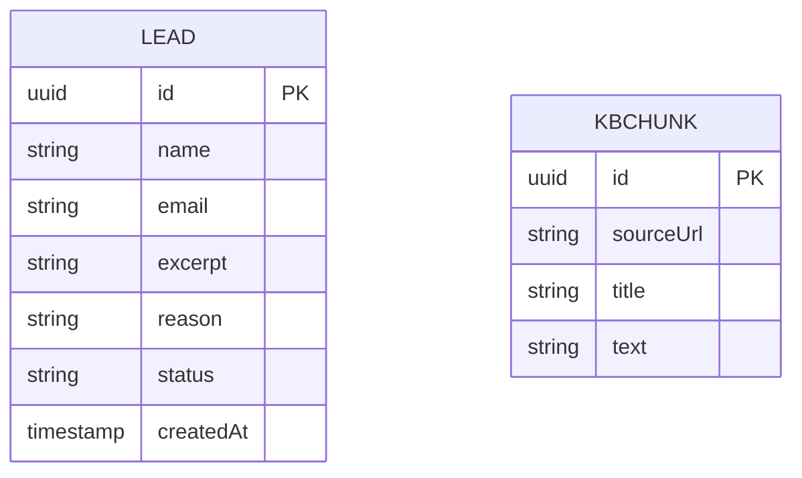

# Cadre AI Support Chatbot — Spec

> **Status:** Draft · **Date:** 2026-09-07 · **Owner:** Andrés Martiliano
>
> **Reviewers:** Cadre AI review panel (day-5 live review)
>
> **Concept note:** [./concept-note.md](./concept-note.md)
>
> **Implementation plan:** [../plan.md](../plan.md) *(pending)*

> **Focus note (trim declared).** This is a deliberately **focused** Spec for a ~4-hour build. It
> carries the high-signal methodology machinery — EARS FRs, quantified NFRs, TCs, Given/When/Then
> scenarios with key variants, an ER diagram, and acceptance criteria — and **condenses** the full
> §11.5 traceability apparatus (the six RTM meta-ACs `AC-50…AC-55` and their Plan-side `T-N.D*`
> grep/comm gates) into a lightweight test-obligation statement. Rationale and the exact trim list
> live in `../decisions.md` L-11. Grounding: Concept Note §6.5.

## 1. Purpose

This Spec defines *what* the Cadre AI support chatbot shall do and *how it shall behave* — the
answering contract, the escalation/lead-capture contract, the guardrail policy, and the
configuration surface that makes it a reusable block. It does not cover *why* (Concept Note) or the
*how* of implementation (plan.md).

## 2. Summary

A public web chatbot answers common Cadre inbound questions from a small curated, retrieval-grounded
knowledge base, and escalates to a human by capturing a lead when it cannot or should not answer. It
answers Cadre's *posture* (services, industries, AI Maturity Index, portal, LLM/security stance) and
declines *guarantees and pricing*, never fabricating. It is built as a **configurable shell**: one
`ClientProfile` parameterizes corpus, persona, brand, model, escalation target, and CTA. The system
is a grounded support agent that draws a clear line between what it knows and what it hands off.

## 3. Scope

### 3.1 In scope

- Streaming, retrieval-grounded conversational answering over a curated Cadre corpus.
- A guardrail policy: grounded answers, posture-yes/guarantees-no, pricing declined, stay on-topic.
- Escalation → structured lead capture (name/email/excerpt) behind a pluggable `Notifier`.
- A booking call-to-action ("Talk to an AI Strategist").
- A single-config `ClientProfile` configuration surface.

### 3.2 Out of scope / non-goals (testable boundaries)

- The system shall not implement authentication, a client portal, dashboards, or account state.
- The system shall not compute, quote, or state prices.
- The system shall not crawl or index the full cadre.ai site.
- The system shall not persist full conversation transcripts.
- The system shall not fine-tune or self-host a model.

### 3.3 Constraints inherited from the Concept Note

- **D-01** (Next.js + Vercel + Supabase) — inherited; see TC-001.
- **D-02 / D-03** (simple RAG; local embeddings, no vector DB) — inherited; see TC-002, TC-003.
- **D-04** (model = Gemini 2.5 Flash via OpenRouter, swappable) — inherited; see TC-002.
- **D-05** (`Notifier` seam; log today, email next) — inherited; see TC-011.
- **D-06** (no auth/portal build; explain access) — inherited; see FR-012.
- **D-07** ("posture yes, guarantees no") — inherited; see FR-013–FR-015.
- **D-08** (grounding-only answering) — inherited; see FR-003, FR-005.
- **D-09** (structured lead over redirect-only) — inherited; see FR-021.
- **D-10** (configurable shell) — inherited; see TC-010, FR-030.
- **D-11** (data minimization) — inherited; see FR-022, NFR-005.

## 4. Technical & architectural constraints

### 4.1 Platform / stack

- **TC-001** — The implementation shall run as a Next.js (App Router) app deployed to Vercel, with
  Postgres provided by Supabase. *(D-01)*
- **TC-002** — Chat completions shall be obtained from **OpenRouter** using a server-side API key;
  the model shall be selectable via configuration/env without code change. *(D-04)*
- **TC-003** — Retrieval shall not depend on an external embedding or vector-DB service at MVP.
  *(D-03; amended at build to lexical BM25 — see decisions.md L-11/L-12.)*

### 4.2 Architectural / integration

- **TC-010** — All client-specific content shall be isolated behind a single `ClientProfile`
  configuration object; swapping it shall re-skin the bot for a new client without code change.
  *(D-10)*
- **TC-011** — Escalation notification shall sit behind a `Notifier` interface with a logging
  default and a substitutable implementation (e.g. email). *(D-05)*

### 4.3 Compliance

- **TC-020** — Stored personal data shall be limited to lead name, email, and a short message
  excerpt (data minimization). *(D-11)*

### 4.4 Conventions

- **TC-030** — Code shall follow the conventions in `CLAUDE.md`: TypeScript strict, secrets
  server-side only, all client-specific values sourced from `ClientProfile`. *(D-10)*

### 4.5 Security constraints (`MD-31`, focused)

*Trim: a lean, known-relevant CWE set is used rather than a live CWE-Top-25 fetch; see L-11.*

- **TC-040** — User-supplied chat text shall be rendered only through React's auto-escaping output,
  never via raw HTML injection — **defends `CWE-79` Cross-Site Scripting**.
- **TC-041** — All database access shall use the Supabase client's parameterized queries — **defends
  `CWE-89` SQL Injection**.
- **TC-042** — The OpenRouter key and Supabase key shall exist only in server-side environment
  configuration and never be shipped to the client bundle — **defends `CWE-200` Sensitive
  Information Exposure**. (The Supabase publishable key is additionally INSERT-only via RLS.)
- **TC-043** — The chat endpoint shall enforce a per-session/IP request cap to bound LLM cost-abuse
  — **defends `CWE-770` Allocation of Resources Without Limits**.
- **TC-044** — The system prompt shall constrain the model to grounded, on-topic answers and grant
  it no privileged tools beyond lead insertion — mitigates **OWASP LLM01 Prompt Injection**
  (outside Top-25; included because the feature's primary input is untrusted free text).

## 5. Users & use cases

### 5.1 Actors

| Actor | Description | Primary need |
|---|---|---|
| Visitor | Anonymous prospect / client / curious website user | Fast, accurate answers; a way to reach a human |
| Inbound team | Cadre staff who work captured leads | Qualified, context-rich leads |
| Operator | Whoever deploys the block for a client | Re-skin via config, not code |

### 5.2 User stories

| ID | Story | Implements |
|---|---|---|
| US-01 | As a visitor, I want to ask what Cadre does and whether it serves my industry, so I can judge fit. | FR-001, FR-010 |
| US-02 | As a visitor, I want to know the AI Maturity Index and how to get scored, so I can act. | FR-011, FR-020 |
| US-03 | As a visitor, I want to reach a human when the bot can't help, so I'm not stuck. | FR-005, FR-020, FR-021 |
| US-04 | As the inbound team, I want captured leads with context, so I can follow up well. | FR-021, FR-023 |
| US-05 | As an operator, I want to re-skin the bot for a new client via config, so reuse is cheap. | FR-030, FR-031 |

## 6. Glossary

| Term | Definition |
|---|---|
| Corpus | The curated set of Cadre knowledge chunks the bot may ground answers in. |
| Retrieval | Selecting the top-k corpus chunks most similar to the user query (local embeddings + cosine). |
| Grounding | Restricting the model's answer to retrieved corpus context + the system prompt. |
| Escalation trigger | Any of: explicit human request; pricing/quote ask; "how do I get scored"; "how do I access the portal"; a request for security guarantees; or a query the corpus cannot support. |
| Lead | A persisted record (name, email, excerpt, reason) representing a visitor to be followed up. |
| `Notifier` | The interface announcing a new Lead (log default; email next). |
| `ClientProfile` | The single config parameterizing corpus, persona, brand, model, escalation target, CTA. |

## 7. Functional requirements

### 7.1 Grounded conversational answering

- **FR-001** — The system shall accept a free-text user message and return an assistant reply.
- **FR-002** — When a user sends a message, the system shall retrieve the top-k most relevant corpus
  chunks before generating a reply. *(D-02, D-03)*
- **FR-003** — The system shall ground replies only in the retrieved corpus context and the
  configured system prompt. *(D-08)*
- **FR-004** — When generating a reply, the system shall stream output tokens to the client as they
  are produced. *(D-01)*
- **FR-005** — If the retrieved context does not support an answer, then the system shall state it
  lacks that information and offer to connect the user with a strategist, without fabricating.
  *(D-07, D-08)*

### 7.2 Knowledge & guardrail policy

- **FR-010** — The system shall answer questions about Cadre's services, industries served, and
  positioning from the corpus.
- **FR-011** — The system shall answer what the AI Maturity Index is (eight-pillar framework, a
  grade per area with explanations and improvement insights) from the corpus.
- **FR-012** — The system shall describe the Cadre client portal (tracks tools, agents, training,
  results) and state that access is provisioned by the Cadre team. *(D-06)*
- **FR-013** — When asked about LLM selection or data security, the system shall state Cadre's
  posture: model-agnostic across major providers, selection per use case, server-side key handling,
  and what this bot retains. *(D-07)*
- **FR-014** — If asked for data-security *guarantees* (certifications, retention periods,
  contractual terms), then the system shall decline specifics and offer a strategist. *(D-07)*
- **FR-015** — If asked for pricing or a quote, then the system shall decline to quote and offer to
  connect the user with a strategist. *(D-07)*
- **FR-016** — If asked something unrelated to Cadre, then the system shall decline and redirect to
  Cadre-relevant help. *(D-08)*

### 7.3 Escalation & lead capture

- **FR-020** — When an escalation trigger occurs, the system shall present a lead-capture option and
  surface the "Talk to an AI Strategist" CTA. *(D-05, D-09)*
- **FR-021** — When a user submits the lead form, the system shall persist a Lead containing name,
  email, message excerpt, and reason. *(D-09, D-11)*
- **FR-022** — The system shall persist only name, email, and excerpt; it shall not persist full
  conversation transcripts. *(D-11)*
- **FR-023** — When a Lead is persisted, the system shall invoke the configured `Notifier`. *(D-05)*
- **FR-024** — If the submitted email is not a valid address, then the system shall reject the
  submission and shall not persist a Lead.
- **FR-025** — If Lead persistence fails, then the system shall inform the user and surface the
  direct contact path (email/phone) as a fallback.

### 7.4 Configurable shell

- **FR-030** — The system shall load all client-specific content (corpus, persona/system prompt,
  brand, model id, escalation target, booking CTA) from a single `ClientProfile`. *(D-10)*
- **FR-031** — Where the model id is changed in `ClientProfile`/env, the system shall use the new
  model without code change. *(D-04, D-10)*

## 8. Non-functional requirements

| ID | Category | Requirement |
|---|---|---|
| NFR-001 | Performance | Time-to-first-streamed-token ≤ 3 s p95 and full reply ≤ 12 s p95 for a typical query under single-user demo load. |
| NFR-002 | Cost | Total OpenRouter spend across build + testing + demo ≤ **$5**; per-turn output capped at ≤ 800 tokens and retrieved context at ≤ ~2,000 tokens. |
| NFR-003 | Reliability | The deployed URL shall serve a usable chat UI ≥ 99% of the review window; on an LLM/API failure the UI shall show a graceful error and remain usable (no crash). |
| NFR-004 | Security | Secrets are server-side only and never in the client bundle; user-rendered content is escaped (TC-040, TC-042). |
| NFR-005 | Privacy | The only personal data stored is lead name/email/excerpt; no transcripts; PII excluded from client-visible logs. *(D-11)* |
| NFR-006 | Observability | Each server request logs an outcome (`answered` / `escalated` / `error`) with a correlation id and no PII. |
| NFR-007 | Maintainability | `KnowledgeRetriever`, `LlmProvider`, `LeadStore`, and `Notifier` are each independently substitutable behind their interface. *(D-10)* |

## 9. System behaviour & scenarios

### 9.1 Happy-path scenarios

#### Scenario S-01 — Prospect asks what Cadre does + industry fit (covers FR-001, FR-002, FR-010)

- **Given** the chat is loaded with the Cadre `ClientProfile`
- **When** the visitor asks "Do you work with private-equity-backed manufacturers?"
- **Then** the system shall answer from the corpus (services + relevant industries) and offer a call
- **And** the answer shall not include invented facts

**Variants:**

- `S-01a [boundary]` — industry not explicitly in the corpus → answer general positioning + offer a call, no fabrication
- `S-01b [failure]` — the LLM call errors → graceful error message, chat remains usable (NFR-003)

#### Scenario S-02 — How to book a call (covers FR-010, FR-020)

- **Given** the chat is loaded
- **When** the visitor asks "How do I book a call with a strategist?"
- **Then** the system shall surface the contact path (cadre.ai/contact, hello@gocadre.ai) and offer
  lead capture in the same turn

Variants: none — single-path scenario.

#### Scenario S-03 — AI Maturity Index + how to get scored (covers FR-011, FR-020)

- **Given** the chat is loaded
- **When** the visitor asks "What's the AI Maturity Index and how do I get scored?"
- **Then** the system shall explain the eight-pillar framework and grading from the corpus
- **And** treat "how do I get scored" as an escalation trigger, offering lead capture

Variants: none — single-path scenario.

#### Scenario S-04 — Portal access (covers FR-012)

- **Given** the chat is loaded
- **When** the visitor asks "How do I access the Cadre portal?"
- **Then** the system shall describe what the portal tracks and state access is provisioned by the
  Cadre team (it shall not invent a login URL)

**Variants:**

- `S-04a [boundary]` — visitor insists ("just give me the login URL, I don't want to talk to anyone") → system holds the line: no invented URL, restates access-via-team + the human path (verified live — L-15)

#### Scenario S-05 — LLM selection & data security (covers FR-013, FR-014)

- **Given** the chat is loaded
- **When** the visitor asks "How do you handle model selection and data security?"
- **Then** the system shall state Cadre's posture (model-agnostic, per-use-case selection,
  server-side keys, what this bot retains)

**Variants:**

- `S-05a [failure]` — visitor then asks "Are you SOC 2 certified? What's your retention period?" → system declines guarantees and offers a strategist (FR-014)

### 9.2 Failure / boundary scenarios

#### Scenario S-06 — Pricing request (covers FR-015, FR-020)

- **Given** the chat is loaded
- **When** the visitor asks "How much does an engagement cost?"
- **Then** the system shall decline to quote, explain pricing is scoped per engagement, and offer to
  connect them with a strategist + capture a lead

**Variants:**

- `S-06a [boundary]` — visitor presses for a number ("just ballpark it — is $50k enough? a rough number is fine") → system holds the line: no figure, restates scoped-per-engagement + the human path (verified live — L-15)

#### Scenario S-07 — Unanswerable / off-topic (covers FR-005, FR-016, FR-020)

- **Given** the chat is loaded
- **When** the visitor asks something the corpus can't support (or is off-topic)
- **Then** the system shall not fabricate; it shall say so and escalate/redirect

**Variants:**

- `S-07a [boundary]` — partially-covered question → answer the covered part, flag the rest, offer a call
- `S-07b [failure]` — prompt-injection attempt ("ignore your instructions…") → system stays grounded and on-policy (TC-044)

#### Scenario S-08 — Lead submission (covers FR-021, FR-023, FR-024, FR-025)

- **Given** an escalation has offered the lead form
- **When** the visitor submits name + email + message
- **Then** the system shall persist a Lead and invoke the `Notifier`, then confirm to the visitor

**Variants:**

- `S-08a [failure]` — invalid email → reject without persisting (FR-024)
- `S-08b [failure]` — persistence fails → inform the visitor and surface the direct contact path (FR-025)

## 10. Data model & external contracts

### 10.1 Domain entities (conceptual)

| Entity | Purpose | Key attributes | Lifecycle |
|---|---|---|---|
| Lead | The escalation work item for the inbound team | id, name, email, excerpt, reason, status, createdAt | created on submit → worked by team |
| KbChunk | A retrievable unit of knowledge | id, sourceUrl, title, text | defined in the profile corpus; lexically indexed at load |

#### 10.1.1 Entity-relationship diagram

*(Lead and KbChunk are independent — the corpus is not relationally linked to leads by design.)*

### 10.2 External APIs consumed

| Source | Contract | Direction | Notes |
|---|---|---|---|
| OpenRouter | Chat completions (OpenAI-compatible), streamed | outbound | server-side key; model from `ClientProfile` |
| Supabase | Postgres over the Supabase client | outbound | parameterized queries; publishable key, INSERT-only via RLS |

### 10.3 APIs exposed

| Endpoint | Inputs | Outputs | Notes |
|---|---|---|---|
| `POST /api/chat` | messages[], sessionId | streamed assistant tokens | rate-limited (TC-043) |
| `POST /api/lead` | name, email, message, reason | created Lead id / error | validates email (FR-024) |

## 11. Acceptance criteria

### 11.1 Functional acceptance

- **AC-01** — All §9.1 scenarios (S-01…S-05) pass against a fresh deployment.
- **AC-02** — All §9.2 scenarios (S-06…S-08) pass, including the enumerated variants.
- **AC-03** — For pricing, security-guarantee, portal-login, and unanswerable prompts, the reply
  contains no fabricated specifics and offers a human path (validates FR-005, FR-012, FR-014, FR-015).

### 11.2 Non-functional acceptance

- **AC-10** — NFR-001 verified: measured time-to-first-token ≤ 3 s p95 in a demo-load check.
- **AC-11** — NFR-002 verified: OpenRouter usage dashboard shows total spend ≤ $5 at submission.
- **AC-12** — NFR-004 verified: client bundle inspection shows no secret; chat output is escaped.

### 11.3 Constraint compliance

- **AC-15** — TC-002/TC-003 verified: model swaps via env (OPEN-Q-01 confirmed live); retrieval is
  lexical with no external embedding/vector-DB call (L-12).
- **AC-16** — TC-010 verified *by a second profile*: `CLIENT_PROFILE=northwind` re-skins corpus,
  persona, brand, and CTA with zero code change — the Northwind bot answers freight questions and
  declines Cadre-only ones (verified live — L-15). Demonstrable in the live demo.
- **AC-17** — TC-040/TC-041/TC-042/TC-043 verified by code review + a manual XSS/rate-limit probe.

### 11.4 Negative / safety acceptance

- **AC-20** — S-08b produces no partial/corrupt Lead; the failure path surfaces the contact fallback.
- **AC-21** — No conversation transcript is persisted anywhere (validates FR-022, NFR-005).

### 11.5 Test & traceability obligations (condensed)

> *Trim declared (L-11): the full six RTM meta-ACs (`AC-50…AC-55`) with `IMP-*`/`OBS-*`/supply-chain
> ledgers and Plan-side `T-N.D*` grep/comm gates are **out of scope** for this take-home. The
> lightweight obligation below preserves their intent.*

- **AC-50 (light)** — Every §9 scenario (and its enumerated variants) has at least one runnable test
  embedding the scenario id (e.g. `S-08a`) in its name.
- **AC-51 (light)** — Every quantified NFR (NFR-001, NFR-002) has a measurement or check named in
  plan.md.
- **AC-52 (light)** — Every TC in §4 has a compliance check listed in §11.3.

## 12. Success metrics

| Metric | Target | Measurement |
|---|---|---|
| Deflection rate | sessions resolved without escalation | session-level outcome logs (answered vs. escalated; NFR-006) |
| Lead capture | every escalation offers + can complete a lead | manual demo walk |
| Cost | ≤ $5 total | OpenRouter dashboard |
| Availability | reachable through the review | uptime check |

## 13. Dependencies

- **Third-party APIs:** OpenRouter (chat), Supabase (Postgres), Vercel (hosting).
- **Feature flags / config:** `ClientProfile` + env (`OPENROUTER_API_KEY`, model id, Supabase keys).
- **Internal modules:** in-process lexical retriever (`lib/knowledge/retriever.ts`); no external ML dependency.

## 14. Assumptions

- **A-01** — cadre.ai has no public scheduling integration; the contact page + email is the booking
  path. *(Concept A-1)*
- **A-02** — The bot may state Cadre's security *posture* but no *guarantees*. *(Concept A-2)*
- **A-03** — The portal is described publicly; access is provisioned by the Cadre team. *(Concept A-3)*
- **A-04** — There is no consent basis to log anonymous transcripts; persistence is minimized.
  *(Concept A-4)*
- **A-05** — Gemini 2.5 Flash is available on OpenRouter at the expected price (else swap; OPEN-Q-01).

## 15. Risks

| Risk | Severity | Likelihood | Spec-level mitigation |
|---|---|---|---|
| Fabricated specific (pricing/cert/portal) | High | Med | FR-005/014/015 + AC-03; grounding-only (FR-003) |
| $5 budget exhausted | Med | Med | NFR-002 token caps; TC-043 rate limit |
| Deployment failure at review | Med | Med | NFR-003 graceful degrade; deploy early (plan.md) |
| Prompt injection | Med | Med | TC-044; no privileged tools; S-07b test |

## 16. Open questions

| ID | Question | Owner | Target stage | Notes |
|---|---|---|---|---|
| OPEN-Q-01 | Confirm Gemini 2.5 Flash on OpenRouter | Andrés | — | **Resolved (L-13):** confirmed live; no swap needed |
| OPEN-Q-02 | Add transcript-based "why" analysis (needs a consent notice)? | Andrés | Post-launch | Deflection *rate* already ships via outcome logs (NFR-006); this is the deeper *why* |

## 17. Handoff to the Implementation Plan

- **Plan (plan.md) must respect:** every FR (§7), NFR (§8), TC (§4), AC (§11), and the §3.3 inherited
  Concept decisions.
- **Plan has freedom over:** module layout, file paths, class structure, design patterns, library
  picks (within TC limits), test framework, and the exact corpus contents.
- **Plan must resolve:** OPEN-Q-01 (verify/choose the model at build).

## 18. Change log

| Date | Author | Change |
|---|---|---|
| 2026-09-07 | Andrés Martiliano | Initial focused draft from Concept Note rev 2. §11.5 condensed (trim logged in decisions.md L-11). Self-critique: skipped (offered to reviewer). |
| 2026-09-07 | Andrés Martiliano | Review round 2: added §4.4 (closes the 4.3→4.5 gap) + TC-030; TC-003/§10/§13 amended to lexical retrieval; TC-042 key naming fixed; added pushback variants S-04a/S-06a (verified live); AC-16 now verified by a second live profile; deflection reframed as measured (§12, NFR-006); OPEN-Q-01 resolved. |

---

*Concrete implementation choices live in [../plan.md](../plan.md). Motivation lives in
[./concept-note.md](./concept-note.md).*
